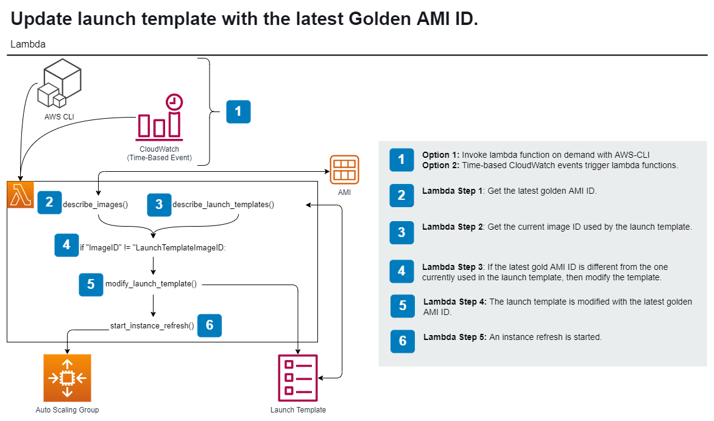

# Update Launch Template and Refresh Auto Scaling Group

## Resources deployed by this manifest:

- Python Lambda Function
- IAM Role for the Lambda

### Deployment diagram:



## Tested with: 

| Environment | Application | Version  |
| ----------------- |-----------|---------|
| WSL2 Ubuntu 22.04 | Terraform | v1.3.1  |
| WSL2 Ubuntu 22.04 | AWS-CLI | v2.7.29  |
## Initialization How-To:

Located in the root directory, create a file called `default.auto.tfvars` with a content like the following:

```bash
aws_profile        = "SomeProfile"
aws_region         = "us-east-1"
name_prefix        = "SomePrefix"
golden_ami_details = {
  ami_platform       = "windows",
  ami_name_regex     = "windows-*",
  launch_template_id = "lt-0123456789abc"
}
```

Initialize the directory to download the necessary modules and start the backend.

```bash
terraform init
```

## Deployment How-To:

Located in the root directory, run the following command:

```bash
terraform apply
```

## Testing the solution:

In the `modules/refresh_asg/scprits` folder you will find a file called `invoke_function.sh`, run that script passing you Auto Scaling Group name as a input varible:

```bash
invoke_function.sh MyAutoScalingGroup
``` 


## Author:

- [@JManzur](https://jmanzur.com)

## Documentation:

- [EXAMPLE](URL)